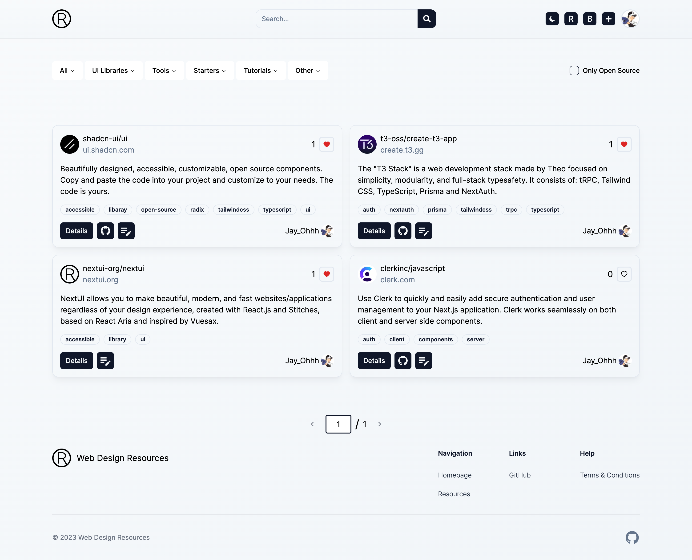

<a href="https://dub.co">
  

  <h1 align="center">Web Design Resources</h1>
</a>

<p align="center">
  A platform for sharing the best design resources, development, applications, articles, UI libraries, tutorials, tools, and software around the web.
</p>

<p align="center">
    <a href="https://github.com/Jay-Ohhh/web-design-resources"></a>
    <a href="https://github.com/Jay-Ohhh/elegant-toast/blob/master/LICENSE" target="_blank" rel="nooppener noreferrer"></a>
</p>

<p align="center">
  <a href="#introduction"><strong>Introduction</strong></a> ·
  <a href="#features"><strong>Features</strong></a> ·
  <a href="#local-development"><strong>Local Development</strong></a> ·
  <a href="#tech-stack"><strong>Tech Stack</strong></a> ·
  <a href="#reference"><strong>Reference</strong></a>
</p>
<br/>

## Introduction

Web Design Resources is a platform for sharing the best design resources, development, applications, articles, UI libraries, tutorials, tools, and software around the web.

**You can visit the website by clicking [here](https://resource.web-sources.net).**

## Features

- User Authentication
- CRUD for resources
- Searching through resources
- Comment
- Profile
- Themes - Light/Dark
- SEO - Google Indexing

## Tech Stack
- [Next.js](https://nextjs.org/) – framework
- [NextAuth.js](https://next-auth.js.org/) – auth
- [Typescript](https://www.typescriptlang.org/) – language
- [Tailwind CSS](https://tailwindcss.com/) – CSS
- [MySQL](https://mysql.com/) – database
- [Prisma](https://prisma.io/) – ORM
- [tRPC](https://trpc.io/) – type-safe framework
- [zod](https://zod.dev/) – schema validation
- [Vercel](https://vercel.com/) – deployments

## Local Development

To develop locally, you will need to clone this repository, install MySQL, and set up all the env vars outlined in the `.env.local.example`

Once that's done, you can use the following commands to run the app locally:

```bash
npm install
npm run db:init
npm run dev
```

## Reference

- [K-Sikora/nextjs-resources](https://github.com/K-Sikora/nextjs-resources)


